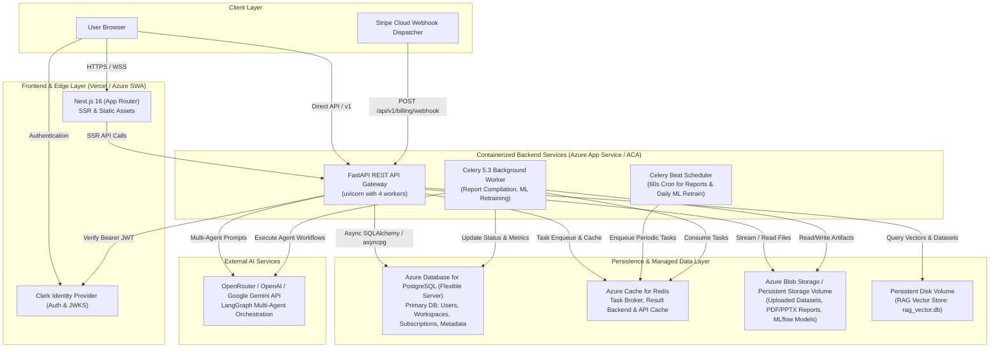

# DataPilot AI Business Intelligence Platform - Production Deployment Plan

## Executive Summary
This document provides a comprehensive, production-grade deployment plan for the DataPilot AI Business Intelligence SaaS platform based on an in-depth codebase audit.

---

## A. Architecture Diagram



---

## B. Frontend Deployment Recommendation

- **Recommended Host**: **Vercel** (Primary Recommendation) or **Azure Static Web Apps (with Node SSR)**.
- **Rationale**:
  - Built with Next.js 16.2.12 (React 19). Vercel provides zero-configuration native optimization, edge caching, image optimization, automatic SSL, and instant rollbacks.
  - If the enterprise requires an Azure-exclusive footprint, deploy as an **Azure Container App** or **Azure App Service (Linux Node.js 20 LTS)** container.
- **Production Architecture Note**:
  - The Next.js catch-all proxy route in `src/app/api/v1/[...path]/route.ts` has a hardcoded reference to `http://127.0.0.1:8000`. In production, browser requests must either:
    1. Direct browser API calls directly to the public backend domain (`NEXT_PUBLIC_API_URL=https://api.yourdomain.com/api/v1`), OR
    2. Update `src/app/api/v1/[...path]/route.ts` to dynamically proxy to an environment variable `INTERNAL_BACKEND_URL`.
- **Clerk Middleware Note**:
  - `src/proxy.ts` contains the Clerk authentication route matcher. In Next.js, middleware must be located at `src/middleware.ts` (or root `middleware.ts`). Rename or forward `src/proxy.ts` to `src/middleware.ts` to enforce route security.

---

## C. Backend Deployment Recommendation

- **Recommended Host**: **Azure Container Apps (ACA)** or **Azure App Service (Linux Web App for Containers)**.
- **Rationale**:
  - FastAPI handles long-running LangGraph multi-agent synthesis calls, dataset chunk streaming, and ReportLab / matplotlib report compiling.
  - Requires persistent network connections, WebSocket support, and CPU-intensive processing that will exceed standard serverless execution timeouts (e.g. AWS Lambda / Vercel 15s-60s timeouts).
  - Azure Container Apps provides auto-scaling from 1 to N instances, built-in ingress with managed TLS, secrets integration with Azure Key Vault, and shared storage mounts.
- **Production Process Configuration**:
  - Do NOT run `python run.py` in production (which contains `reload=True`).
  - Container Entrypoint:
    ```bash
    uvicorn app.main:app --host 0.0.0.0 --port 8000 --workers 4 --proxy-headers --forwarded-allow-ips='*'
    ```

---

## D. Database Deployment Recommendation

- **Recommended Service**: **Azure Database for PostgreSQL (Flexible Server)**.
- **Specification**:
  - Minimum Tier: General Purpose (2 vCores, 8 GB RAM, 64 GB Storage) with Auto-grow and automated daily geo-redundant backups.
  - PostgreSQL Version: **16**.
  - Connection Pool: Use built-in PgBouncer on port 6432 or configure SQLAlchemy async engine pooling.
- **Resiliency Warning in Application Code**:
  - In `backend/app/core/database.py`, `check_postgres_availability()` executes a TCP probe against `settings.POSTGRES_SERVER`. If `DATABASE_URL` is configured with an external connection string (e.g., Azure PostgreSQL) but `POSTGRES_SERVER` is left as `"localhost"`, the check will fail and the backend will silently fall back to `local_dev.db` (SQLite).
  - In production, set `POSTGRES_SERVER` and connection parameters explicitly, or disable the SQLite fallback in production environments (`if is_prod and USE_SQLITE: raise RuntimeError(...)`).

---

## E. Redis & Worker Deployment Recommendation

- **Redis Cache & Celery Broker**:
  - **Recommended Service**: **Azure Cache for Redis** (Basic/Standard C1 tier) or a managed Redis 7 instance.
  - Configured via `REDIS_HOST` and `REDIS_PORT` (or `CELERY_BROKER_URL`).
- **Celery Background Worker**:
  - Deploy as an **Azure Container App background worker** (no public ingress, always-on: `min_replicas=1`).
  - Command:
    ```bash
    celery -A app.worker.celery_app worker --loglevel=info --concurrency=4
    ```
- **Celery Beat Scheduler**:
  - Deploy as a **singleton Azure Container App replica** (`min_replicas=1, max_replicas=1`).
  - Command:
    ```bash
    celery -A app.worker.celery_app beat --loglevel=info
    ```
  - **Crucial**: Running more than 1 replica of Celery Beat will cause duplicate scheduled reports and duplicate ML retraining runs.

---

## F. File & Object Storage Recommendation

- **Current State**:
  - Uploaded datasets are written to `backend/app/uploads/` on local disk.
  - Generated reports (PDF, PPTX, HTML, PNG snapshots) are saved to `storage/reports/` on local disk.
  - MLflow experiments and models are saved to `sqlite:///mlflow.db` and `./mlruns/`.
  - DuckDB RAG vector repository writes to `rag_vector.db`.
- **Production Recommendation**:
  1. **Short-Term / Immediate (Container Volume Mount)**:
     - Attach an **Azure File Share** (NFS/SMB persistent volume) mounted to `/app/storage` and `/app/uploads` across both the `api` and `celery_worker` containers. This allows Celery workers to compile reports and write files that the API container can serve via `FileResponse`.
  2. **Strategic / Recommended**:
     - Integrate **Azure Blob Storage** (or AWS S3) with signed URLs (`generate_presigned_url`) for dataset uploads and report downloads.
     - Move MLflow artifact store to Azure Blob Storage (`--default-artifact-root wasbs://...`).

---

## G. Stripe Production Configuration

- **Stripe Dashboard Actions**:
  1. Register Webhook Endpoint in Stripe Dashboard:
     - URL: `https://api.yourdomain.com/api/v1/billing/webhook`
     - Events to subscribe:
       - `checkout.session.completed`
       - `customer.subscription.updated`
       - `customer.subscription.deleted`
       - `invoice.paid`
       - `invoice.payment_failed`
  2. Create Production Products & Prices:
     - Create "Growth Plan" ($49/month or relevant SaaS tier) in Live Mode.
     - Copy the live `price_...` ID to `STRIPE_GROWTH_PRICE_ID`.
  3. Customer Portal:
     - Enable and configure Customer Portal in Stripe Settings with cancelation and payment method management.
  4. Environment Variables:
     - Replace all `sk_test_...`, `pk_test_...`, and `whsec_...` with live credentials `sk_live_...`, `pk_live_...`, and live webhook secret.
     - Set `FRONTEND_URL=https://app.yourdomain.com` in backend environment so checkout and portal return URLs redirect to production.

---

## H. Domain & DNS Configuration

| Subdomain | Target Service | Purpose |
| :--- | :--- | :--- |
| `app.yourdomain.com` | Vercel / Azure SWA | Next.js Frontend Application |
| `api.yourdomain.com` | Azure Container App / App Service | FastAPI Backend Gateway |
| `clerk.yourdomain.com` (CNAME) | Clerk FAPI (`clerk.accounts.dev` or custom) | First-party authentication cookies |

---

## I. Environment Variables Audit

### 1. Frontend Environment Variables

| Variable Name | Environment | Required in Prod? | Description |
| :--- | :--- | :--- | :--- |
| `NEXT_PUBLIC_API_URL` | Production | **YES** | Public API gateway URL (e.g. `https://api.yourdomain.com`) |
| `NEXT_PUBLIC_CLERK_PUBLISHABLE_KEY` | Production | **YES** | Live Clerk Publishable Key (`pk_live_...`) |
| `CLERK_SECRET_KEY` | Production | **YES** | Live Clerk Secret Key (`sk_live_...`) |
| `NEXT_PUBLIC_CLERK_SIGN_IN_URL` | All | **YES** | Route path: `/sign-in` |
| `NEXT_PUBLIC_CLERK_SIGN_UP_URL` | All | **YES** | Route path: `/sign-up` |
| `NEXT_PUBLIC_CLERK_AFTER_SIGN_IN_URL` | All | **YES** | Redirect route: `/dashboard` |
| `NEXT_PUBLIC_CLERK_AFTER_SIGN_UP_URL` | All | **YES** | Redirect route: `/dashboard` |
| `NEXT_PUBLIC_STRIPE_PUBLISHABLE_KEY`| Production | **YES** | Live Stripe Publishable Key (`pk_live_...`) |
| `NEXT_PUBLIC_DEV_AUTH_BYPASS` | Development | **NO (MUST BE REMOVED/FALSE)** | Development auth bypass |

### 2. Backend Environment Variables

| Variable Name | Environment | Required in Prod? | Description |
| :--- | :--- | :--- | :--- |
| `ENVIRONMENT` | Production | **YES** | Must be set to `production` |
| `NODE_ENV` / `APP_ENV` | Production | Recommended | Set to `production` |
| `PROJECT_NAME` | Production | Optional | Platform display name |
| `API_V1_STR` | Production | Optional | Defaults to `/api/v1` |
| `POSTGRES_SERVER` | Production | **YES** | Azure PostgreSQL host |
| `POSTGRES_USER` | Production | **YES** | Azure PostgreSQL admin user |
| `POSTGRES_PASSWORD` | Production | **YES** | Azure PostgreSQL password |
| `POSTGRES_DB` | Production | **YES** | Database name (e.g. `ai_bi_db`) |
| `POSTGRES_PORT` | Production | **YES** | Port `5432` |
| `DATABASE_URL` | Production | Optional | Direct connection string |
| `REDIS_HOST` | Production | **YES** | Azure Redis host |
| `REDIS_PORT` | Production | **YES** | Azure Redis port (`6379` or `6380` for SSL) |
| `CELERY_BROKER_URL` | Production | Optional | Direct Redis broker URL with SSL |
| `CELERY_RESULT_BACKEND` | Production | Optional | Direct Redis result URL with SSL |
| `SECRET_KEY` | Production | **YES** | 64-char random hex key (`openssl rand -hex 32`) |
| `API_KEYS` | Production | **YES** | Comma-delimited list of secure production API keys |
| `ALLOWED_ORIGINS` | Production | **YES** | Allowed domains: `https://app.yourdomain.com` |
| `FRONTEND_URL` | Production | **YES** | Public frontend URL: `https://app.yourdomain.com` |
| `CLERK_SECRET_KEY` | Production | **YES** | Live Clerk Secret Key (`sk_live_...`) |
| `CLERK_JWKS_URL` | Production | **YES** | Clerk JWKS URL (`https://api.clerk.com/v1/jwks`) |
| `OPENROUTER_API_KEY` | Production | **YES** | Live OpenRouter API Key |
| `OPENROUTER_MODEL` | Production | **YES** | Production model (e.g. `openai/gpt-4o-mini`) |
| `OPENROUTER_BASE_URL` | Production | Optional | `https://openrouter.ai/api/v1` |
| `LLM_PROVIDER` | Production | **YES** | `openrouter` |
| `STRIPE_SECRET_KEY` | Production | **YES** | Live Stripe Secret Key (`sk_live_...`) |
| `STRIPE_PUBLISHABLE_KEY` | Production | **YES** | Live Stripe Publishable Key (`pk_live_...`) |
| `STRIPE_WEBHOOK_SECRET` | Production | **YES** | Live Stripe Webhook Signing Secret (`whsec_...`) |
| `STRIPE_GROWTH_PRICE_ID` | Production | **YES** | Live Stripe Growth Plan Price ID (`price_...`) |
| `RATE_LIMIT_PER_MINUTE` | Production | Optional | API request rate limit (e.g. `120`) |
| `SENTRY_DSN` | Production | Recommended | Sentry monitoring DSN |
| `OTEL_EXPORTER_OTLP_ENDPOINT`| Production | Optional | OTel Collector Endpoint |
| `DEV_AUTH_BYPASS` | Development | **NO (MUST BE FALSE OR OMITTED)** | Development bypass |

---

## J. CORS Configuration

- **Current Finding in `backend/app/main.py`**:
  - `allow_origins=origins`: Appends hardcoded dev origins (`localhost:3000`, `localhost:3001`, `localhost:8000`).
  - `allow_origin_regex`: Permits `localhost`, `127.0.0.1`, and all private RFC1918 subnets (`192.168.*`, `10.*`, `172.16-31.*`).
- **Production Requirement**:
  - In production (`ENVIRONMENT=production`), disable the local IP regex.
  - Set `ALLOWED_ORIGINS=https://app.yourdomain.com` (and any preview deployment subdomains).
  - Retain `allow_credentials=True` to support Clerk JWT cookie and authorization headers.

---

## K. Database Migration Procedure

1. **Current Schema State**:
   - Alembic is installed but contains **0 version migration scripts** in `backend/alembic/versions/`.
   - The application relies on `Base.metadata.create_all` and manual dynamic schema upgrade functions in `backend/app/main.py` (`check_and_upgrade_datasets_table`, `check_and_upgrade_users_table`, etc.).
2. **Production Action Plan**:
   - Step 1: Before initial production deployment, run an Alembic revision to capture the baseline schema:
     ```bash
     cd backend
     alembic revision --autogenerate -m "initial_production_schema"
     ```
   - Step 2: In the CI/CD pipeline, execute database migrations before spinning up the updated API containers:
     ```bash
     alembic upgrade head
     ```
   - Step 3: Ensure the production PostgreSQL user has full DDL permissions (`CREATE TABLE`, `ALTER TABLE`, `CREATE INDEX`).

---

## L. Build Commands

- **Frontend Build**:
  ```bash
  npm ci
  npm run build
  ```
- **Backend Docker Build**:
  ```bash
  docker build -t datapilot-backend:latest -f backend/Dockerfile backend/
  ```

---

## M. Start Commands

- **Frontend Production Start**:
  ```bash
  npm run start
  ```
- **Backend Production Start (API Gateway)**:
  ```bash
  uvicorn app.main:app --host 0.0.0.0 --port 8000 --workers 4 --proxy-headers --forwarded-allow-ips='*'
  ```
- **Celery Worker Start**:
  ```bash
  celery -A app.worker.celery_app worker --loglevel=info --concurrency=4
  ```
- **Celery Beat Start**:
  ```bash
  celery -A app.worker.celery_app beat --loglevel=info
  ```

---

## N. Health-Check Endpoints

1. **Liveness Probe**:
   - `GET /live`
   - Returns: `{"status": "alive"}` (Status 200). Verifies HTTP process responsiveness.
2. **Readiness Probe**:
   - `GET /ready`
   - Returns: Detailed probe verifying PostgreSQL, Redis, and DuckDB connectivity. Returns HTTP 503 if any core service is disconnected.
3. **Deep Diagnostic Probe**:
   - `GET /health` or `GET /api/v1/health`
   - Returns: Connectivity status for FastAPI, PostgreSQL, Redis, DuckDB, and LLM diagnostic metadata.
4. **LLM Connectivity Probe**:
   - `GET /api/v1/health/llm`
   - Active probe testing prompt dispatch against OpenRouter.
5. **Prometheus Metrics**:
   - `GET /metrics`

---

## O. Logging & Monitoring

- **Sentry**:
  - Configured in `backend/app/main.py` via `sentry_sdk.init(dsn=settings.SENTRY_DSN)`.
  - Set `SENTRY_DSN` in production for automatic uncaught exception reporting and performance transaction traces.
- **OpenTelemetry (OTel)**:
  - Configured in `backend/app/core/telemetry.py`.
  - Set `OTEL_EXPORTER_OTLP_ENDPOINT` if shipping traces to Azure Monitor / Application Insights / Jaeger.
- **Structured JSON Logging**:
  - `LOG_FORMAT=json` outputs structured logs compatible with Azure Log Analytics and Datadog.

---

## P. Deployment Order

To avoid downtime and broken dependencies, execute deployments in the following strict order:

1. **Provision Infrastructure**: Azure PostgreSQL, Azure Cache for Redis, Storage Volumes/Shares.
2. **Database Migration**: Run `alembic upgrade head` against production PostgreSQL.
3. **Deploy Backend Dependencies**:
   - Deploy `celery_worker` container.
   - Deploy `celery_beat` container (1 replica).
4. **Deploy Backend API**:
   - Deploy `api` container. Verify `/live` and `/ready` probes return 200.
5. **Configure Stripe Webhook**:
   - Verify HTTPS webhook delivery to `https://api.yourdomain.com/api/v1/billing/webhook`.
6. **Deploy Frontend**:
   - Deploy Next.js frontend to Vercel or Azure SWA with production backend URL.
7. **Verify End-to-End**:
   - Run post-deployment testing checklist.

---

## Q. Rollback Strategy

1. **Frontend Rollback**:
   - Vercel: Instant rollback to the previous deployment artifact via Vercel dashboard or CLI (`vercel rollback`).
   - Azure SWA: Re-tag or redeploy previous GitHub Actions build.
2. **Backend Rollback**:
   - Revert Azure Container App revision to previous active revision (`az containerapp revision activate`).
3. **Database Rollback**:
   - Downgrade schema: `alembic downgrade -1` (if migration was additive/reversible).
   - If irreversible schema corruption occurs, restore from automated Azure PostgreSQL point-in-time backup.

---

## R. Production Security Checklist

- [ ] Disable `DEV_AUTH_BYPASS` in backend environment (must be `false`).
- [ ] Remove `NEXT_PUBLIC_DEV_AUTH_BYPASS` from frontend environment.
- [ ] Set `ENVIRONMENT=production` in backend.
- [ ] Generate unique 64-character cryptographically random `SECRET_KEY`.
- [ ] Rotate `API_KEYS` and do not use default `admin-secret-api-key-12345`.
- [ ] Set `ALLOWED_ORIGINS` to exact production domain(s); remove wildcards.
- [ ] Switch Clerk to Live Mode and update publishable and secret keys.
- [ ] Switch Stripe to Live Mode; update API keys, Webhook Secret, and Price ID.
- [ ] Secure Swagger/OpenAPI docs in production (disable `docs_url` or gate behind authentication).
- [ ] Remove Git-tracked SQLite/DuckDB/report files (`rag_vector.db`, `local_dev.db`, `mlflow.db`, `storage/reports/*`) and clean repository history.

---

## S. Post-Deployment Testing Checklist

1. **Health Probes**: Verify `GET /live` (200), `GET /ready` (200), and `GET /health` report all services healthy.
2. **Authentication Flow**: Sign up a new user via Clerk, complete email verification, and verify user record creation in PostgreSQL.
3. **Dataset Ingestion**: Upload a CSV file (e.g. 5 MB) and verify DuckDB schema discovery and data preview.
4. **AI Multi-Agent Execution**: Send a question in Chat (e.g., "Analyze revenue trends") and verify OpenRouter LangGraph agent execution.
5. **Executive Reports**: Trigger an executive report generation. Verify Celery task completes, PDF compiles, snapshot renders, and file downloads properly.
6. **Stripe Checkout**: Initiate Growth Plan checkout. Complete test card transaction in Stripe test mode (or real small live test). Verify webhook event processing and workspace entitlement update to "Growth".
7. **Customer Portal**: Open customer portal link and verify subscription management screen loads.
8. **Observability**: Verify logs appear in Azure Log Analytics / Sentry with no 500 errors.

---
