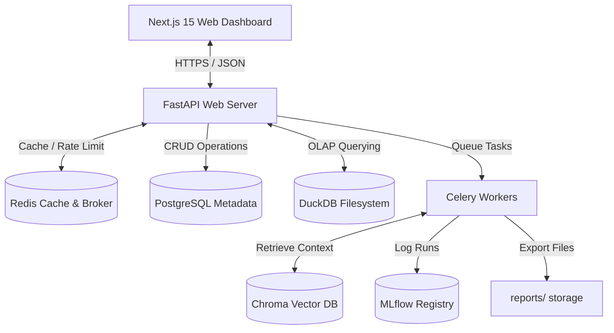

# AI Business Intelligence Platform

[](LICENSE)
[](pyproject.toml)
[](package.json)
[](pyproject.toml)
[](https://github.com/astral-sh/ruff)

An enterprise-ready, production-hardened Business Intelligence (BI) Platform. This portfolio repository showcases a full-stack architecture combining a high-performance **Next.js 15+** dashboard frontend, a robust **FastAPI** backend, **DuckDB** for lightning-fast SQL data query execution, and background **Celery** workers for heavy computation. 

The application integrates a **LangGraph multi-agent orchestration** flow, **Retrieval-Augmented Generation (RAG)** document indexing, classical and ML forecasting pipelines, and a compilation engine that generates downloadable PDF/PowerPoint executive briefs.

Designed with production-grade platform engineering practices: featuring **OpenTelemetry** request tracing, **Prometheus** metrics, **Sentry** exception logging, **Redis** distributed caching and sliding-window rate limiting, and role-based access controls (RBAC).

---

## 🛠️ Technology Stack

* **Frontend**: Next.js (App Router), TypeScript, Tailwind CSS, Recharts.
* **Backend**: FastAPI (Python 3.12+), SQLAlchemy (Asyncpg), Alembic, Pydantic v2.
* **Analytics Engine**: DuckDB (in-memory OLAP), Pandas, Scikit-learn, Statsmodels (ARIMA/SARIMAX forecasting).
* **AI Orchestration**: LangGraph, LangChain, Chroma (vector store database).
* **Caching & Message Broker**: Redis (connection pools, in-memory backup).
* **Background Tasks**: Celery, Celery Beat (periodic scheduled crons).
* **Observability**: OpenTelemetry SDK, Prometheus fastapi-instrumentator, Sentry.
* **Database**: PostgreSQL (metadata store), DuckDB (file-backed OLAP).
* **Infrastructure**: Docker, Multi-Stage secure Dockerfile, Docker Compose.

---

## 🚀 Key Production Capabilities

### 1. Advanced Observability & Telemetry
* **Distributed Tracing**: Out-of-the-box OpenTelemetry instrumentation generating trace spans for all HTTP endpoints.
* **Prometheus Metrics**: Custom telemetry exposed via `/metrics` capturing latency histograms for API requests, DuckDB queries, vector database retrievals, LangGraph agent runs, ML inferences, and Celery tasks.
* **Structured JSON Logging**: Centralized log outputs formatted to JSON to easily integrate with cloud pipelines (Splunk, AWS Cloudwatch, ELK).
* **Sentry Integration**: Global exception middleware reporting traceback alerts in production environments.

### 2. Hardened Enterprise Security & RBAC
* **Secure Cryptographic JWTs**: Cryptographically signed HS256 tokens with secure JWT expiry and refresh token renewal procedures.
* **Role-Based Access Control (RBAC)**: Role checks (`require_role`) guarding restricted admin views and actions under four access levels:
  * `Admin`: Unlimited read/write/delete configurations.
  * `Executive`: View dashboards, request customized reports, and inspect ML forecasts.
  * `Analyst`: Run SQL sandbox queries, retrain ML models, and edit KPI parameters.
  * `Viewer`: Read-only dashboard access.
* **API Key Auth**: High-privilege HTTP header validation (`X-API-Key`) for automated CI/CD and automation script runs.
* **Rate Limiting**: Sliding-window rate limiter utilizing Redis hashes to track and throttle client queries.
* **Secure HTTP Headers & CORS**: Clickjacking frame ancestor blocks, MIME sniff prevention, and strict allowed origin validation.

### 3. Distributed Cache Layer
* **High-Performance Redis Caching**: Thread-safe caching wrapper with transparent memory fallback for offline developer ease.
* **Cache Coverage**:
  * DuckDB SQL queries (MD5 query hashing).
  * Machine learning classifier predictions (Timestamp-safe JSON serialization).
  * RAG document retrievals.
  * Computed dashboard metrics and executive reports list.
* **Invalidation Triggers**: Active invalidation hooks evicting cache records on sheet uploads, deletions, model retraining, and report compilations.

### 4. Health Probes
* `/live`: Instant liveness verify check.
* `/ready`: Performs deep network checks to Postgres, Redis sockets, and DuckDB file connections, returning `503 Service Unavailable` if downstream systems are offline.

---

## 📂 Project Architecture



For detailed pipeline diagrams (LangGraph multi-agent flow, RAG architectures, ML retraining, and request lifecycles), see **[ARCHITECTURE.md](docs/ARCHITECTURE.md)**.

---

## 📖 Directory Layout

```
├── .github/workflows/       # GitHub Actions CI/CD workflows
├── backend/                 # FastAPI Backend Codebase
│   ├── app/
│   │   ├── core/            # Database configs, caching, security middleware, telemetry
│   │   ├── db/              # SQLAlchemy schemas and DB sessions
│   │   ├── features/        # Layered business logic modules (Auth, Analytics, ML, RAG, Agents)
│   │   └── main.py          # FastAPI application initialization
│   ├── tests/               # Pytest suite (units, integrations, production mocks)
│   ├── Dockerfile           # Multi-stage production container manifest
│   ├── docker-compose.yml   # Multi-service setup (DB, Redis, Celery, API, Beat)
│   └── pyproject.toml       # Python package requirements and configurations
├── src/                     # Next.js Frontend Codebase
│   ├── app/                 # Next.js routes and app pages
│   ├── features/            # Feature-specific hooks, components, and api logic
│   └── shared/              # Reusable UI widgets and hooks
├── sample_data/             # Mock datasets for sales, finance, and marketing testing
├── docs/                    # Deep dive design documentation and deployment books
└── Makefile                 # Unified project commands interface
```

---

## 🛠️ Quick Start (Local Development)

The easiest way to start all application services is using the root **Makefile**:

```bash
# Install dependencies for both Frontend and Backend
make install

# Start PostgreSQL, Redis, FastAPI, Celery, and Next.js concurrently
make dev

# Run all automated tests
make test

# Format code and run lints
make lint
```

For manual configurations and detailed virtual environment setup, see the **[Developer Guide](docs/DEVELOPER_GUIDE.md)**.

---

## 📋 Documentation Reference

We have compiled structured guides detailing every aspect of this project:

* 📚 **[Architecture Blueprint](docs/ARCHITECTURE.md)**: Deep dive with 11 Mermaid flowcharts of pipelines, schemas, and agents.
* 📦 **[Developer Guide](docs/DEVELOPER_GUIDE.md)**: Workspace configuration, environment structures, and Makefile usage.
* 🚀 **[Deployment Operational Guide](docs/DEPLOYMENT.md)**: Steps for deploying to Railway, Render, Azure, and Docker Compose.
* 📊 **[Sample Datasets Guide](docs/SAMPLE_DATA.md)**: Details on CSV imports, ML schemas, and analysis walkthroughs.
* 🎬 **[Demo script & Showcase Guide](docs/DEMO_GUIDE.md)**: Presentation scripts and recording guidelines.
* 🛡️ **[Quality Audit Report](docs/QUALITY_REVIEW.md)**: Project debt analysis, performance optimizations, and future enhancements.

---

## 📄 License
Distributed under the MIT License. See [LICENSE](LICENSE) for more information.
