# Architecture Blueprint

This document details the software architecture, design patterns, data pipelines, and operational flowcharts of the AI Business Intelligence Platform. 

---

## 1. Overall System Architecture

The platform follows a decoupled, service-oriented architecture designed to handle heavy analytics queries and background machine learning pipelines without blocking the web request lifecycle.

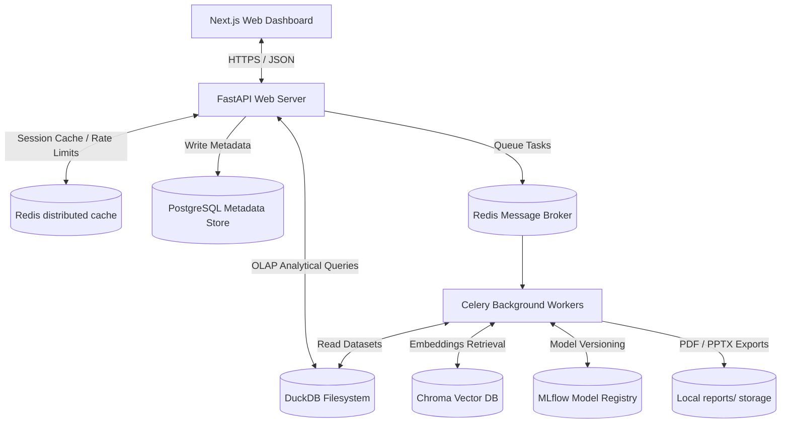

---

## 2. Frontend Architecture

The frontend is built using Next.js 15 App Router. It is modularly grouped by **features** rather than arbitrary folder directories.

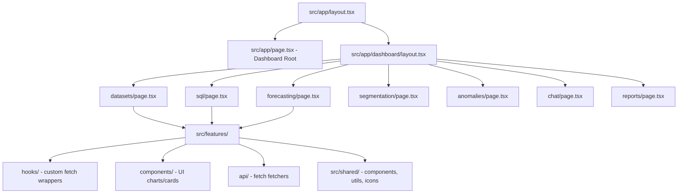

---

## 3. Backend Architecture

The backend FastAPI structure is structured under a clean, layered design that separates HTTP routing, dependency checkouts, business logic, and database access.

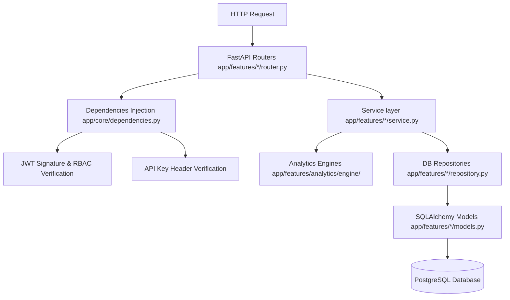

---

## 4. Database Schema (ERD)

PostgreSQL stores metadata related to system execution, reports, and scheduled cron configurations. Analytical datasets are stored as separate CSV/Parquet files and queried via DuckDB.

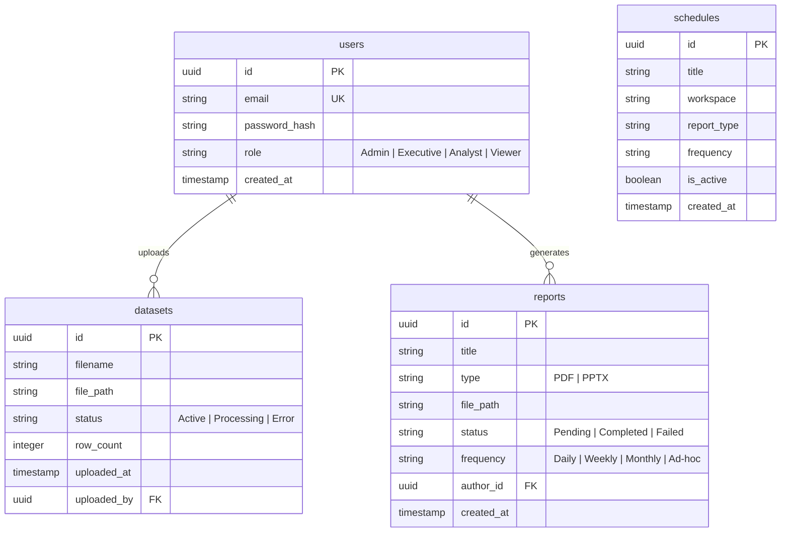

---

## 5. Data Ingestion Pipeline

When a user uploads a new dataset, it is validated, saved to disk, and automatically registered for analytical queries via DuckDB.

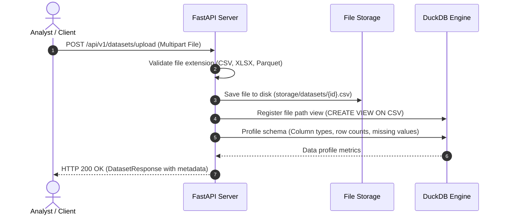

---

## 6. Machine Learning Pipeline

Models are trained in background Celery workers, logged, registered, and immediately cached for subsequent predictions.

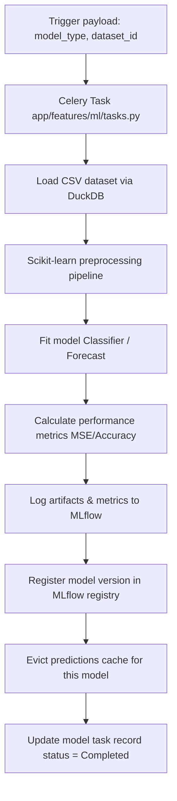

---

## 7. RAG Ingestion & Retrieval Architecture

The RAG pipeline enables users to query their unstructured PDF reports, utilizing a hybrid search strategy that blends keyword matching with vector embeddings.

### Document Ingestion Flow
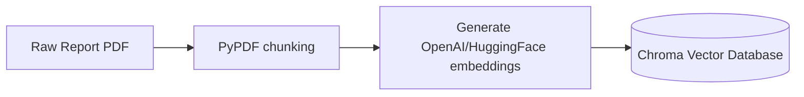

### Retrieval & Synthesis Flow
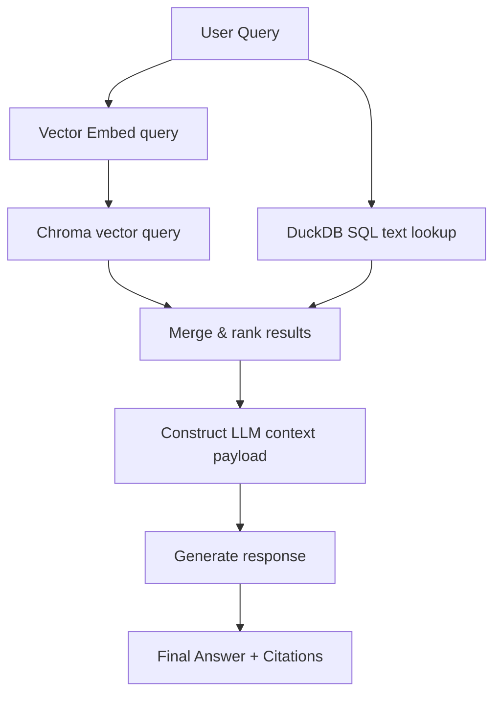

---

## 8. LangGraph Multi-Agent Workflow

The agentic chat workspace runs on a state-based multi-agent system built using LangGraph, routing queries dynamically to specialized analytics nodes.

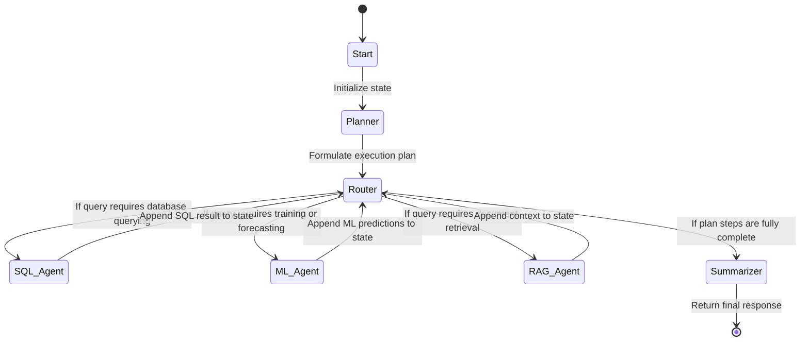

---

## 9. Executive Reporting Pipeline

Executive reports are scheduled or triggered on-demand, running in the background to compile data visualizations and tabular KPIs into PDF/PowerPoint documents.

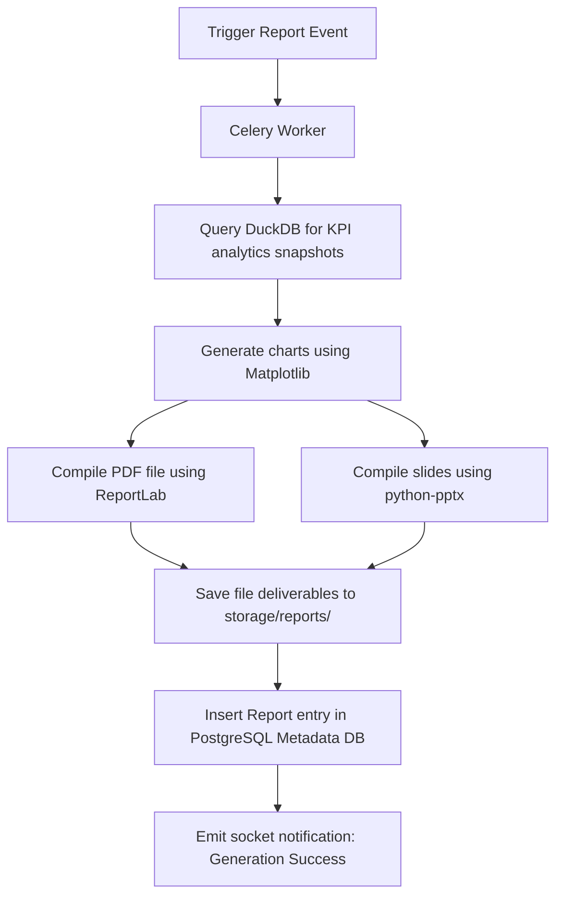

---

## 10. Deployment Architecture

For high availability and performance scaling, the platform is deployed in isolated network subnets, splitting stateless API queries from computation-heavy workers.

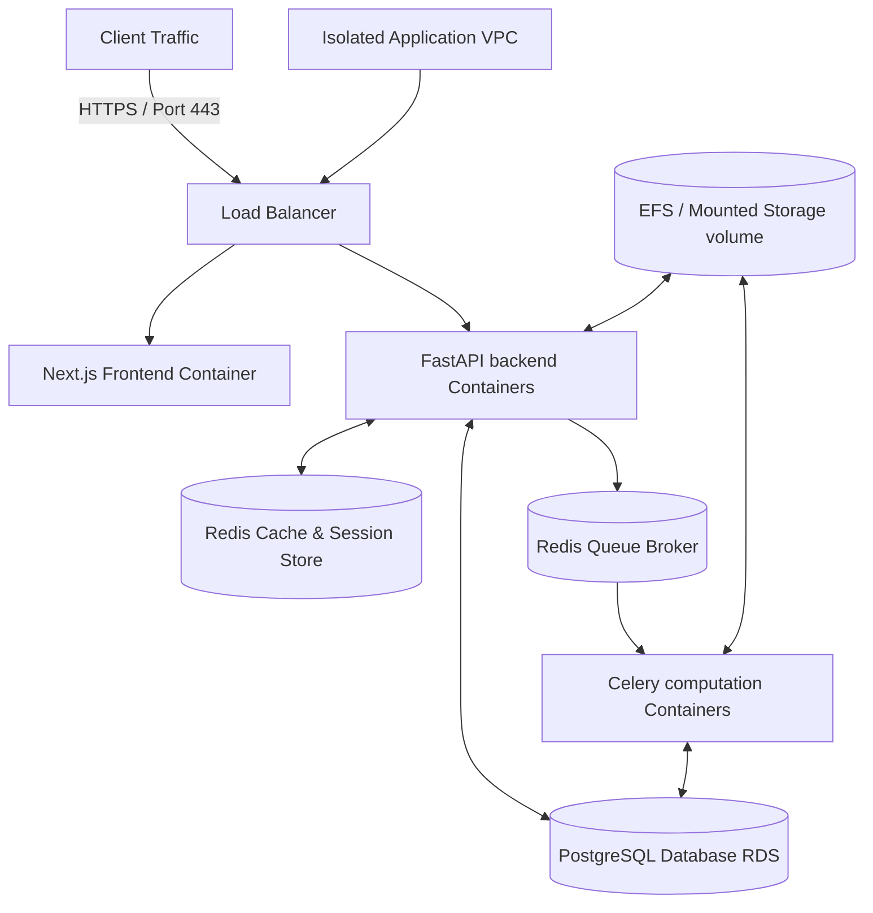

---

## 11. Request Lifecycle

The chronological sequence of middleware processing for every HTTP request hitting the FastAPI server:

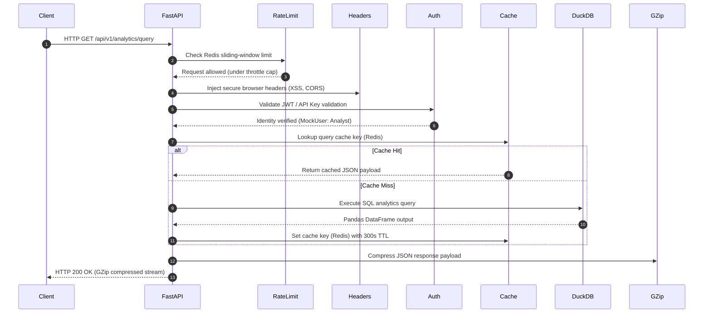
